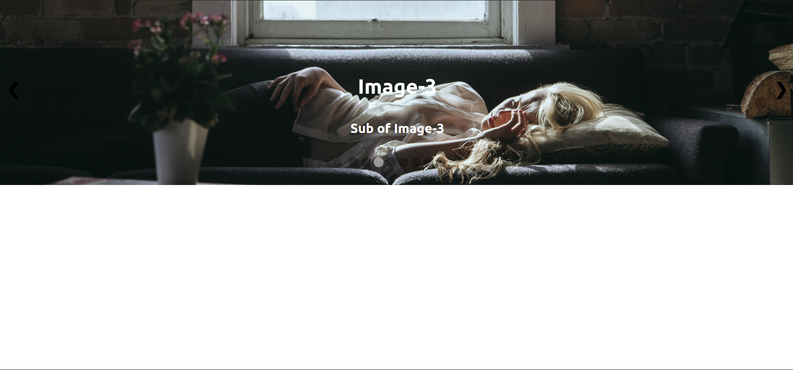

# Clone the Project First
<br>

# To Run the  Server Side
## 1. Go to Server Folder and Type in terminal ```npm install``` .
## 2. Then type ```npm start```.

<br>

# To Run the Client Side
## 1.Go to Client Folder and Type in terminal ```yarn install``` .
## 2.Then type ```yarn start```.

<br>

# Sample Snap Shots




